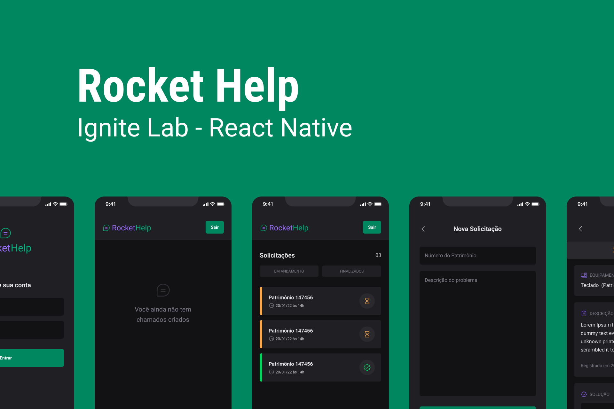

<p align="center">
  

  
 
  <a href="https://github.com/bfukumori/rockethelp/commits/master">
    
  </a>
    
   
   <a href="https://github.com/bfukumori/rockethelp/stargazers">
    
  </a>

  <a href="">
    
  </a>
</p>

<h1 align="center">
    
</h1>

<p align="center">
  <a href="#about">About</a> •
  <a href="#features">Features</a> •
  <a href="#how-it-works">How it works</a> • 
  <a href="#tech-stack">Tech Stack</a> • 
  <a href="#author">Author</a> • 
  <a href="#user-content-license">License</a>
</p>

<div align="center"> 
	
</div>

## About

📱 rockethelp - App for managing technical orders and solutions

Project developed during Ignite Lab from [Rocketseat](https://www.rocketseat.com.br/ignite).

---

## Features

- [x] Create an order
- [x] List orders by filter
- [x] Update an order as completed
- [x] Basic auth with email and password
- [x] Persist orders in database

---

## How it works

### Pre-requisites

Before you begin, you will need to have the following tools installed on your machine:
[Git] (https://git-scm.com), [Node.js] (https://nodejs.org/en/), [Expo Go] (https://expo.dev/client), [Android Studio] (https://developer.android.com/studio).
In addition, it is good to have an editor to work with the code like [VSCode] (https://code.visualstudio.com/) and you need an Google Account to use Firebase services.

#### Running the web application (Mobile)

```bash

# Clone this repository
$ git clone git@github.com:bfukumori/rockethelp.git

# Access the project folder in your terminal
$ cd rockethelp

# Install the dependencies
$ npm install

# Run the application in development mode:
## Android
$ npm run android

## iOS
$ npm run ios

## Expo go (can't use Firebase at the moment)
$ npm run start

# You can read more about setting the development environment at: https://react-native.rocketseat.dev/

```

---

## Tech Stack

The following tools were used in the construction of the project:

#### **Website**  ([React Native](https://reactnative.dev/)  +  [TypeScript](https://www.typescriptlang.org/))

- **[PhosphorIcons](https://phosphoricons.com/)**
- **[Native Base](https://nativebase.io/)**
- **[Firebase](https://firebase.google.com/docs)**
- **[Expo Cli](https://docs.expo.dev/workflow/expo-cli/)**

---
## Author

<a href="https://www.facebook.com/bruno.fukumori.9/">
 
 <br />
  
 <sub><b>Bruno Fukumori</b></sub></a> <a href="https://www.facebook.com/bruno.fukumori.9/" title="facebook"></a>
 <br />

[](https://twitter.com/hi_fukujp) [](https://www.linkedin.com/in/bfukumori/) 
[](mailto:brunofukumori@gmail.com)

---

## License

This project is under the license [MIT](./LICENSE).

---
